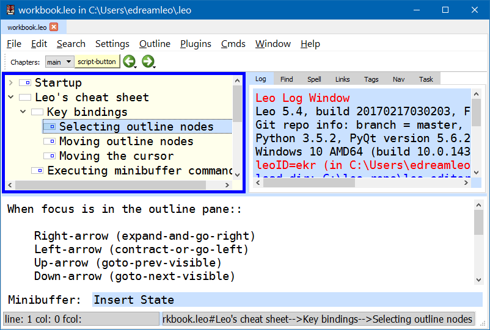

.. rst3: filename: docs\tutorial-basics.html

.. |---| unicode:: U+02015
   :trim:
   
.. |br| raw:: html

    

##################
10 分钟体验 Leo
##################

..  "Edward...you've come up with perhaps the most powerful new concept in
..  code manipulation since VI and Emacs."---David McNab
    
本章介绍 Leo 最重要的特性和概念.

.. contents:: 目录
    :depth: 3
    :local:

Leo 的主窗口
++++++++++++++++

下面是 Leo 主窗口的截图:

   
.. index::
    pair: Body pane; Tutorial
    pair: Expansion box; Tutorial
    pair: Icon area; Tutorial
    pair: Log pane; Tutorial
    pair: Main Window; Tutorial
    pair: Outline pane; Tutorial
    pair: Status line; Tutorial

Leo 的主窗口, 由 **图标区域**  (菜单下方),  **提纲窗格** (左上方),  **日志窗格** (右上方) , **正文窗格** (左下方), **可选的视图窗格** (右下方) 组成. **minibuffer** (**迷你缓冲**) 和 **状态行**, 位于主界面的底部.

日志窗格由多个标签组成. **日志标签** 显示来自 Leo 的信息, **查找标签**  显示 Leo 的查找/替换命令的状态. 其他标签也可能出现在日志窗格: **拼写标签** 控制 Leo 的拼写检查. **补全标签** 显示支持的输入自动补全.

.. index::
    pair: Icon box; Tutorial
    pair: Node; Tutorial
    pair: Headline; Tutorial
    pair: Body text; Tutorial

Leo 存储所有数据至 **节点**. 节点有 **标题** (提纲窗格显示) 和 **正文**. 正文窗格显示
**当前选中节点** 的正文, 其节点标题在提纲窗格中被选中.  标题的 **图标框** 表明节点状态. 例如,  当节点修改后, 图标框的边线变黑.

命令
++++++

.. _`Leo 命令索引`: commands.html
.. _`Leo minibuffer`: commands.html#executing-commands-from-the-minibuffer
.. _`输入补全`: commands.html#executing-commands-from-the-minibuffer
.. _`按键绑定`: commands.html#key-reference
.. _`Emacs minibuffer`: https://www.gnu.org/software/emacs/manual/html_node/emacs/Minibuffer.html 

Leo 有百余种命令, 如 `Leo 命令索引`_ 所述. **非常重要**: 你可以 (且应该) 首先无视这些命令中的绝大多数. 执行命令, 可使用 `按键绑定`_, 或在 `Leo minibuffer`_ *使用名称*, 类似 `Emacs minibuffer`_. 

激活命令, 可在 minibuffer 中输入命令全名并敲击 ``<Return>``, 但那将是海量工作. 相反, 
你应该使用 **输入补全** 避免大部分输入. 例如, 你可以这样执行 *sort-lines* (行分类) 命令:::

    <Alt-X>so<Tab>
    
现在, minibuffer 将列出以 "so" 开头的所有命令的常用前缀, 即:::

    sort-
    
输入 l<Tab> 后, minibuffer 将包含::

    sort-lines
    
现在,  按 <Return> 即可执行命令. 输入补全将很快成为第二天性.

**非常重要**: 无需记住 Leo 命令的确切名称. 相反, 你只需记住几个常用的命令前缀, 例如::

    clone-find  查找节点 命令
    file-       文件 命令
    find-       查找 命令
    isearch-    incremental search commands
    leo-        打开 .leo 文件
    open-       打开文件或网址
    print-      打印 命令
    sort-       分类 命令
    toggle-     切换设置命令
    
下述命令作用于 minibuffer 本身:
    
``Alt-X (命令全名)``
    通过输入全名, 执行任意命令.
    
``Ctrl-P (重复复杂命令)``
    重复 minibuffer 最后输入的命令名称
    
在 minibuffer 中, 下述按键将被特别对待:

``<Return>``
    执行命令.

``<Tab>``
    显示所有的有效补全.

``<BackSpace>``
    显示更多补全.
    
``Ctrl-G``
    退出 minibuffer , 聚焦于正文窗格.
    
``UpArrow``
    在命令历史中, 调至更早的命令. 第一个 向上箭头 等价于 ``Ctrl-P``.

``DownArrow``
    在命令历史中, 调至更近的命令.

提纲和克隆
+++++++++++++++

.. _`功能齐全的提纲编辑器`: commands.html#outline-commands

Leo 是一个 `功能齐全的提纲编辑器`_, 拥有可插入, 删除, 移动, 升级, 降级节点的命令.

**克隆** 是 Leo 的一个独特功能. 所有提纲节点都可被克隆. 克隆节点实际上是 **相同的** 节点, 只是出现在提纲的不同地方. 对任一克隆的更改, 都会同步在节点的所有其他克隆上, *包括他们的后代节点*. 例如, 假设 A` 节点是 A 节点的克隆::

    - A`
        - B
        - C
    - D
    - A`
        - B
        - C
        
右移 C, 提纲变成::

    - A`
        - B
            - C
    - D
    - A`
        - B
            - C
            
.. _`clone-find 命令`:
            
克隆允许你在单一提纲内创建数据的多种视图. 例如, Leo 的 `clone-find 命令`_ 创建所有已找到节点的克隆, 移动这些新建的克隆, 使他们成为描述搜索条件的 **组织节点** 的子节点. 组织节点是提纲数据的全新视图, 聚焦于搜索出的节点!

Leo 指令
++++++++++

.. index::
   pair: Directive; Tutorial

Leo **指令** 控制 Leo 的运行. 指令在正文的起始位置, 以 ``@`` 开头. 指令 **应用于后代**, 直到在后代节点中被覆盖.

.. index::
    pair: @color; Tutorial
    pair: @nocolor; Tutorial
    pair: @nocolor-node; Tutorial

**@color**, **@nocolor** 和 **@nocolor-node** 指令控制语法高亮. **注意**: 包含多个颜色指令的节点, **不会** 影响后代节点的颜色::

    @color
    @nocolor
    @nocolor-node
    
.. index::
    pair: @language; Tutorial

**@language** 指令指示哪种语言有效::

    @language python
    @language c
    @language rest # restructured text
    @language plain # plain text: no syntax coloring.

.. index::
    pair: @pagewidth; Tutorial
    pair: @tabwidth; Tutorial
    pair: Negative tab width; Tutorial

**@pagewidth** 指令设置页面宽度 (格式化段落使用). **@tabwidth** 指令控制缩进. 负数制表符 (推荐 Python 使用) 转化制表符为空格::

    @pagewidth 100
    @tabwidth -4
    @tabwidth 8

.. index::
    pair: @wrap; Tutorial
    pair: @nowrap; Tutorial
    
**@wrap** 和 **@nowrap** 启用和禁用正文中的自动换行::

    @nowrap
    @wrap
    
**@first** 指令确保其后跟的内容, 出现在每一个外部文件 (阅读下一部分) 的开头.  多个 @first 指令可行. 这些指令必须出现在正文的 **首行**.

    @first # -*- coding: utf-8 -*-
    @first #! /usr/bin/env python
    
.. _`指令索引`: directives.html
    
Leo 的其他指令, 如 `指令索引`_ 所述.

外部文件
++++++++++++

Leo 提纲可索引 **外部文件**, 即文件系统中的文件. 当打开 Leo 提纲时, Leo 会快速加载文件. 下节仅讨论基础. 更多细节请移步 `Leo 索引指南 <directives.html>`_ .

\@file
******

.. index::
    pair: @file node; Tutorial

** @file 节点**: 节点标题以 `@file` 开头, 后跟外部文件的路径.::

    @file leoNodes.py
    @file ../../notes.txt

@file 节点及其后代, 代表了一个外部文件. 当你更改 Leo 外的外部文件时, Leo 会自动更新 @file 节点. 当保存提纲时, Leo 自动将所有对 @file 树的修改写入外部文件.

标记
******

.. in tutorial-basics.html (External files)

.. index::
    pair: Markup; Tutorial

Leo 的 **标记** 显示 Leo 如何从 @file 树中创建外部文件. 标记可出现在任意正文中, 且 **必须** 出现在 @file 节点本身的正文中.

标记有两种: **章节索引** (<<这是我们的部分>>) 和 **@others** 指令. 章节索引指向 **命名节点**, 即 *标题* 看起来像章节索引的节点. @other 指向所有 *其他* (未命名) 节点. 下面是一个 python 文件典型的 @file 节点的正文::

    @first # -*- coding: utf-8 -*-
    '''whatever.py'''
    << imports >>
    @others
    # 可以了, 哥们
    @language python
    @tabwidth
    
子节点必须定义 <<import>> 节点以及 Controller 类的方法.

当写入这个文件时, Leo 编写头两行::

    @first # -*- coding: utf-8 -*-
    '''whatever.py'''
    
后跟 <<imports>> 节点的 *正文*, 所有 *other* 节点的正文, 按照提纲顺序, 后跟注释 #可以了, 哥们.

\@clean
*******

.. index::
    pair: @clean; Tutorial

当编写 **文件树** 时, Leo 将 **结构注释** 写入外部文件. 这些注释代表了提纲结构. 将一个 @file 树写入 .leo 文件时, Leo 只写入根 @file 节点. 为避免注释, 使用 **@clean** 代替 @file::

    @clean leoNodes.py
    @clean ../../notes.txt
    
使用 @clean 的副作用: Leo 将保存整个 @clean 树至 .leo 文件.

\@all
*****

.. index::
    pair: @all; Tutorial
    pair: Outline Order; Tutorial

**@all** 指令使 Leo 将 **@file 树** 的节点写入外部文件, *忽视* 所有标记. 结果, Leo 将节点按照 **提纲顺序** 写入文件, 即所有节点在提纲中展开时的顺序.

配置 Leo
++++++++++

.. index::
    pair: leoSettings.leo; Tutorial
    pair: Global Settings; Tutorial
    pair: myLeoSettings.leo; Tutorial
    pair: Personal Settings; Tutorial
    pair: Local Settings; Tutorial
    pair: Configuration file; Tutorial
    
Leo 对几乎 *所有* 操作均使用提纲, 包括配置 Leo:

- **leo/config/leoSettings.leo** 包含了 Leo 的默认 **全局设置**. 除非你是 Leo 的开发人员, 否则不要修改这个文件.

- **~/myLeoSettings.leo** 包含你的 **个人设置**. Leo 不会自动创建此文件: 你应自己创建. myLeoSetting.leo 中的设置, 将覆盖 (增补) leoSettings.leo 中的默认设置.

- 其他 .leo 文件也可能包含 **本地设置**. 本地设置仅适用于那个文件, 且覆盖所有其他设置.

**设置节点** 指定设置. 这些节点 *必须* 是 **@settings** 节点的后代. 从 @settings 树移出设置节点, 将取消设置. 标题以 @ 开头, 后跟类型或值. 举例如下, 其中正文在标题下缩进::

    @bool vim_mode = False
    
    @color flash_brackets_background_color = red
    
    @data global-abbreviations
        # 正文包含缩写.
        date;;={|{x=time.strftime("%Y/%m/%d")}|}
        trace;;=trace = <|bool|> and not g.unitTesting
        al;;=@language
        alh;;=@language html\n
        alj;;=@language javascript\n
        alm;;=@language md\n
        alp;;=@language python\n
        alr;;=@language rest\n@wrap\n
        nc;;=@nocolor\n
        ncn;;=@nocolor-node\n
    
    @string script_file_path = ../test/scriptFile.py

    @enabled-plugins
        # 可使用的插件列表
        plugins_menu.py
        free_layout.py
        mod_scripting.py
        backlink.py
        bigdash.py
        bookmarks.py
        contextmenu.py

    @shortcuts
        # 正文包含个人按键绑定
        file-open-by-name   = Ctrl-O
        save-all            = Ctrl-S
        
.. _`配置指南`: customizing.html

更多信息, 请移步 Leo 的 `配置指南`_.

插件
++++++

.. _`bookmarks.py`:     plugins.html#bookmarks-py
.. _`contextmenu.py`:   plugins.html#contextmenu-py
.. _`mod_scripting.py`: plugins.html#mod-scripting-py
.. _`quicksearch.py`:   plugins.html#quicksearch-py
.. _`todo.py`:          plugins.html#todo-py
.. _`valuespace.py`:    plugins.html#valuespace-py
.. _`viewrendered.py`:  plugins.html#viewrendered-py

.. index::
    pair: Plugins; Tutorial

`Leo 插件 <plugins.html>`_  是 Python 程序, 扩展了 Leo 的功能. 插件存放在 leo/plugins 文件夹. **@enabled-plugins** 设置节点开启插件. Leo 有很多插件, 包括:

- `bookmarks.py`_ 管理和显示书签.
- `contextmenu.py`_ 右击标题显示文本菜单.
- `mod_scripting.py`_ 支持 @button 和 @command 节点.
- `quicksearch.py`_ 增加 Nav 标签搜索.
- `todo.py`_  提供待办事项清单和简单的项目管理功能.
- `valuespace.py`_  增加提纲导向的表格功能.
- `viewrendered.py`_  创建呈现窗格以及其中的内容.

脚本基础
++++++++++++

非程序员: 随意跳过这部分.

脚本标记
************

.. in tutorial-basics.html (Scripting basics)

Leo 的标记适用于脚本和外部文件. Leo 的 execute-script (执行脚本) 命令, 使用标记, 从选定的节点中 **组成** 脚本. 例如: 此正文定义了一个脚本的头部分::

    '''My script'''
    << imports >>
    class Controller:
        # 子节点定义此类的方法.
        @others
    Controller(c).run # c *is* defined.

**重要**: Leo 在任何地方都可识别章节索引, 即使在字符串或评论内. 请移步 `这个 FAQ 入口 <http://leoeditor.com/FAQ.html#what-about-code-that-looks-like-a-section-reference>`_.

c, g 和 p
**********

.. _`指挥官`: tutorial-basics.html#accessing-outline-data
.. _`位置`: tutorial-scripting.html#positions-and-vnodes

execute-script 命令预先定义了三个名称: c, g 和 p. **c** 是执行脚本的提纲的 `指挥官`_. **g** 是 ``leo.core.leoGlobals`` 模块, 包含很多有用的函数和类. **p** 是当前选定节点的 `位置`_

访问提纲数据
******************

** Commander 类** 同时定义了一个脚本 API 和 DOM (文档对象模块), 后者可以 *完全* 访问提纲中的所有数据.
例如:

    '''
        打印提纲的所有标题, 正确缩进, 
        以及每个节点正文的字符个数.
    '''
    # c.all_positions() 是一个 Python 生成器, 按提纲顺序, 生成所有位置.
    for p in c.all_positions():
        print('%3s %s %s' % (
            len(p.b),       # p.b is p's body text.
            ' '*p.level(),  # p.level() is p's indentation level.
            p.h,            # p.h is p's headline.
        )

.. _`脚本教程`: tutorial-scripting.html

更多信息, 请移步 Leo 的 `脚本教程`_.

\@button 和 @command 节点
****************************

.. index::
    pair: Script Button; Tutorial
    pair: @button Node; Tutorial
    pair: @command Node; Tutorial

**@command 节点** 定义命令. 运行命令所执行的脚本, 可适用于其他任何提纲节点. 即, p 与当前选择的节点捆绑, 而 *不是* @button 节点. **@button 节点** 同样运作, 同时在图标区域创建一个按钮. 点击那个按钮执行命令. 例如, 下面节点定义了 打印树 命令, 并与 Ctrl-9 捆绑::

    @command print-tree @key=Ctrl-9 # 标题
    
    '''
        打印所选子树的所有标题, 正确缩进, 
        以及每个节点正文的字符个数.
    '''
    # p.self_and_subtree() 是一个 python 生成器, 按提纲顺序, 
    # 生成 p 和 p 的子树的所有位置.
    for p in p.self.and_subtree():
        print('%3s %s %s' % (
            len(p.b),       # p.b 是 p 的正文
            ' '*p.level(),  # p.level() 是 p 的缩进级别
            p.h,            # p.h 是 p 的标题
        )
        
.. index::
    pair: @test Node; Tutorial

\@test 节点
*************

**@test nodes** 创建单元测试. @test 节点自动将正文转换成一个单元测试的子类. 使用 Leo 的 ``run-unit-test-`` 命令运行这些测试. ``<Alt-X>run<tab>`` 提供完整列表. 下面是 Leo 的实际单元测试::

    @test c.positionExists for all nodes # 标题

    for p in c.all_positions():
        assert c.positionExists(p)
    
在 @test 节点中, c, g 和 p 同样已预定义. 另外, **self** 是单元测试的实例. TestCase 由 @test 节点创建. 例如::
  
    self.assertTrue(g)
    
更多细节, 请移步 `Leo 的单元测试索引 <unitTesting.html>`_.

自动补全和 calltips
************************

**自动补全** 提醒你所有包含在 Leo 源代码对象中的成员(函数, 方法, 变量等), 以及 Python 的标准库模块中的成员. ``Alt-1 (toggle-autocompleter)`` 运行和禁止自动补全. **注意**: 自动补全只有在 @language python 有效时才可使用.

例如, 仅输入 "c.atF" (在正文窗格中, 同时允许自动补全) , 即在内容窗格中自动插入 "c.atFileCommands", 因为 "c.atFileCommands" 是 "c.atF" 仅有的补全.

另一个例子, 输入 "at.writeA" 将显示 (在日志窗格的自动补全标签) leoAtFile.py 中的所有 write 命令::

    writeAll:method
    writeAllHelper:method
    writeAtAutoNodes:method
    writeAtAutoNodesHelper:method
    writeAtShadowNodes:method
    writeAtShadowNodesHelper:method

当显示单个补全时, 输入 '?' 将显示方法的文档字符串. 例如, "c.atFileCommands.write?" 显示::

    Write a 4.x derived file.
    root is the position of an @<file> node
    
**Calltips** 显示了函数和方法的期待参数. ``Alt-2 (toggle-calltips)`` 启用和禁用 calltips. 当 @language python 有效时, ``(`` 显示 calltips.
``<Return>`` 或 ``Ctrl-G (keyboard-quit)`` 退出 calltips. Calltips 作用于任何 Python 函数或方法, 包括 Python 的全局函数.
例如:

    g.toUnicode(            g.toUnicode(s, encoding, reportErrors=False
    c.widgetWantsFocusNow(  c.widgetWantsFocusNow(w
    reduce(                 reduce(function, sequence[, initial]) -> value

总结
++++++

Leo 是一个功能齐全的提纲编辑器, 特性如下:

- 指令控制 Leo 如何运行.
- @file 和 @clean 节点创建外部文件.
- myLeoSettings.leo 指定你的个人设置.
- 插件扩展 Leo. @enabled-plugins 设置节点启用插件.

对程序员::

- Leo 拥有一个易用的脚本 API, 可完全访问提纲中的所有数据.
- @button 和 @command 节点定义了脚本, 其适用于所有 *other* 节点.
- @test 节点创建单元测试.
- Alt-1 启用自动补全.

.. _`求助`: https://groups.google.com/forum/#!forum/leo-editor
.. _`Leo 命令索引`: commands.html

Leo 有百余种命令, 如 `Leo 命令索引`_ 所述. 请随时参阅 `求助`_.

翻译: `OMlalala <https://github.com/OMlalala>`_
 
校对: `hetao <https://github.com/livingworld>`_

